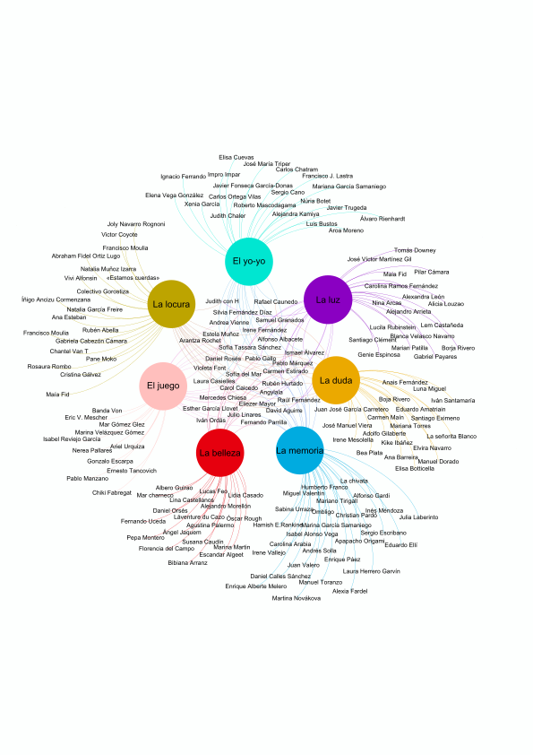

# _La gran belleza_ data analysis 

Text and network analysis of data from the Spanish language literary magazine [_La gran belleza_](https://www.lagranbelleza.es/). Graphics used for the purposes of promotion on social media.

## Output of project
* Word clouds and bar charts (see below) analysing the vocabulary of the short stories 
* Graph of collaboration network
* Posted on [instagram](https://www.instagram.com/p/B3W1-9WCbjn/?utm_source=ig_embed&utm_campaign)

## Input
* 300 short stories written in Spanish with a total of 324733 words submitted to the spring 2020 edition of the magazine.
* List of 160 collaborators and details about which of the 7 magazine issues they worked on.

## Tools used:
* python-docx, odfpy, pywin32 and tika for converting documents to plain text
* spacy and gensim for natural language processing
* pandas, matplotlib and wordcloud for plot generation
* networkx and Gephi for the graph analysis and visualization

## Notes
The full texts have not been included in this repo for copyright reasons.

# Collaboration network

# Wordclouds

# Single word and bigram bar charts

