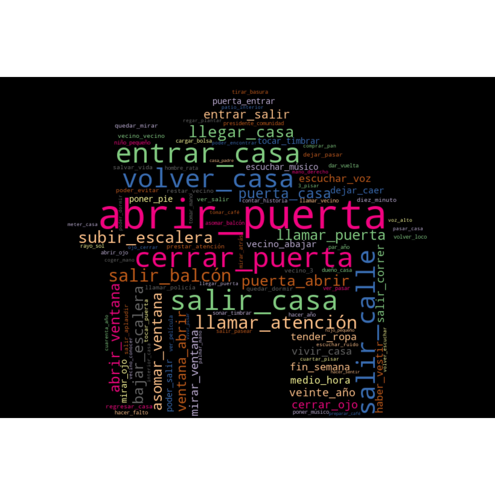
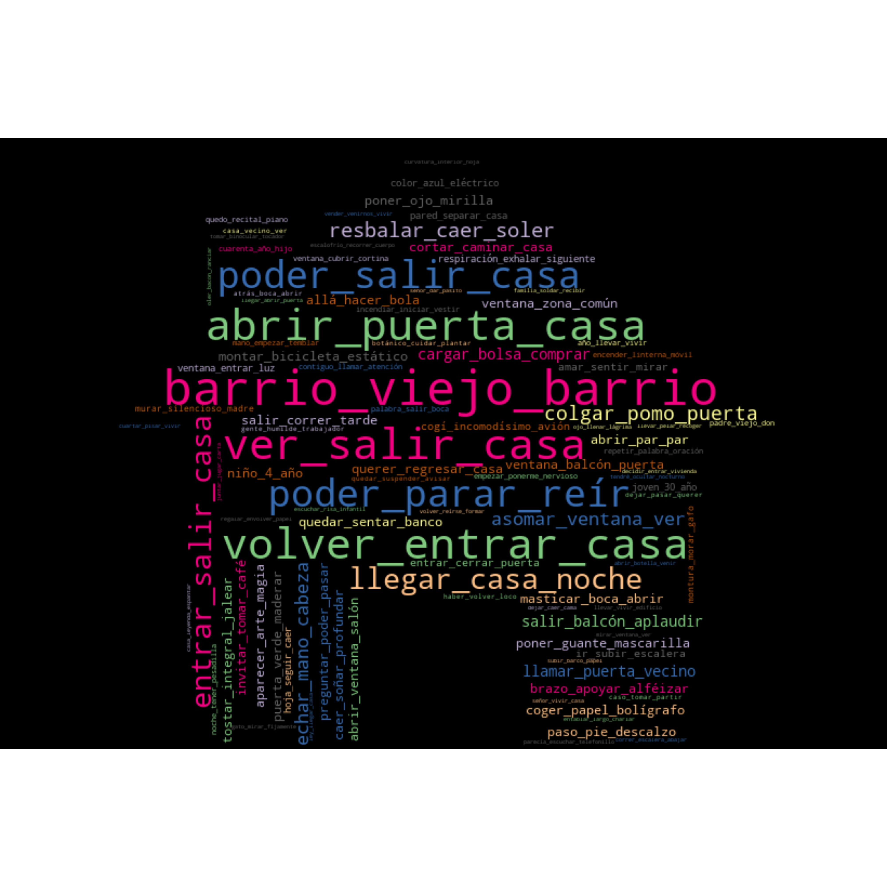
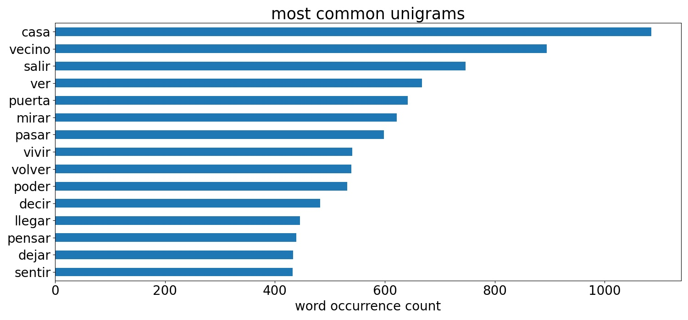
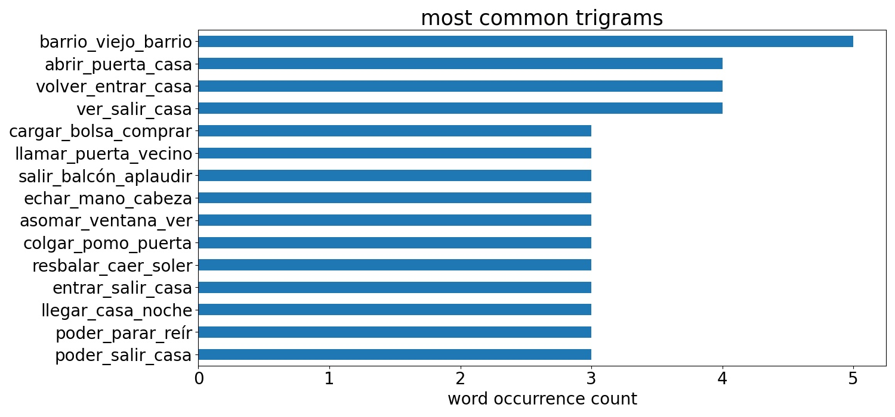

# _La gran belleza_ short stories text analysis

Analysis of the spring 2020 short story submissions to the literary magazine _La gran belleza_. Graphics used for the purposes of promotion on social media.

## Output of project
Word clouds and bar charts (see below) analysing the frequency of vocabulary of the short stories.

## Tools used:
* python-docx, odfpy, pywin32 and tika for converting documents to plain text
* spacy and gensim for natural language processing
* pandas, matplotlib and wordcloud for plot generation

## Notes
The full texts have not been included in this repo for copyright reasons.

# Wordclouds

# Single word, bigram and trigram bar charts

